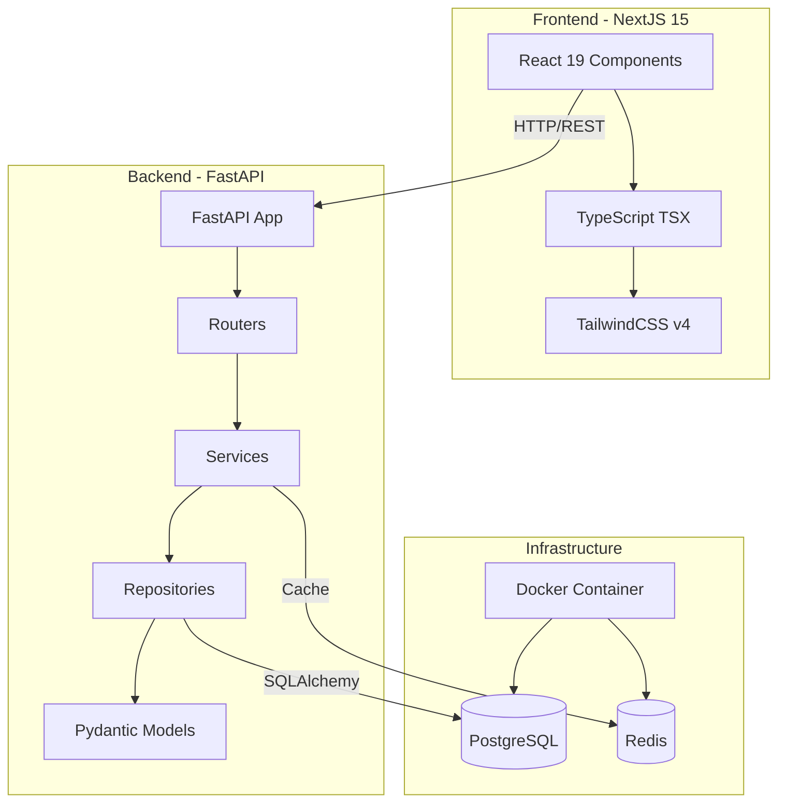
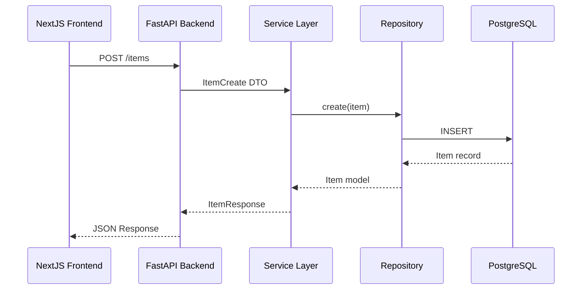

# Technical Analysis: CRUD Two App

A comprehensive analysis of this full-stack application's architecture, design patterns, and implementation recommendations.

---

## Executive Summary

This project is a **full-stack CRUD application** combining:

- **Frontend**: NextJS 15.5.2 (React 19) with TypeScript and TailwindCSS v4
- **Backend**: Python FastAPI with Pydantic data validation
- **Infrastructure**: DevContainer-based development environment with Docker Compose

The current implementation represents a **starter template** with foundational structure in place. This analysis provides recommendations for evolving it into a production-ready application.

---

## Table of Contents

1. [Frontend Analysis (NextJS)](#1-frontend-analysis-nextjs)
2. [Backend Analysis (FastAPI)](#2-backend-analysis-fastapi)
3. [DevContainer & Infrastructure](#3-devcontainer--infrastructure)
4. [Design Patterns & Best Practices](#4-design-patterns--best-practices)
5. [Recommendations](#5-recommendations)
6. [Architecture Diagram](#6-architecture-diagram)

---

## 1. Frontend Analysis (NextJS)

### Current Implementation

| Component         | Details                           |
| ----------------- | --------------------------------- |
| **Framework**     | NextJS 15.5.2 with App Router     |
| **Runtime**       | Turbopack (enabled)               |
| **React Version** | 19.1.0 (latest)                   |
| **Styling**       | TailwindCSS v4 with CSS variables |
| **Typography**    | Geist Sans & Geist Mono fonts     |
| **Linting**       | ESLint v9 with Next.js config     |

### File Structure Analysis

```
ui/
├── app/
│   ├── page.tsx       # Main page (default Next.js template)
│   ├── layout.tsx     # Root layout with fonts & metadata
│   ├── globals.css    # TailwindCSS + CSS custom properties
│   └── favicon.ico    # App icon
├── public/            # Static assets (SVGs)
├── package.json       # Dependencies & scripts
├── tsconfig.json      # TypeScript configuration
└── next.config.ts     # NextJS configuration (minimal)
```

### Strengths

| Strength            | Description                                       |
| ------------------- | ------------------------------------------------- |
| ✅ Modern Stack     | React 19 + NextJS 15 (latest)                     |
| ✅ Type Safety      | Strict TypeScript enabled                         |
| ✅ Fast Development | Turbopack for quick rebuilds                      |
| ✅ Dark Mode        | CSS custom properties with `prefers-color-scheme` |
| ✅ Path Aliases     | `@/*` configured for clean imports                |

### Areas for Improvement

| Area                | Recommendation                          |
| ------------------- | --------------------------------------- |
| 🔸 Components       | Create reusable component library       |
| 🔸 State Management | Add Zustand/Redux for complex state     |
| 🔸 API Integration  | Implement API service layer             |
| 🔸 Testing          | Add Jest/Vitest + React Testing Library |
| 🔸 Error Handling   | Implement error boundaries              |

---

## 2. Backend Analysis (FastAPI)

### Current Implementation

| Component          | Details               |
| ------------------ | --------------------- |
| **Framework**      | FastAPI (latest)      |
| **Server**         | Uvicorn with Gunicorn |
| **Validation**     | Pydantic BaseModel    |
| **Python Version** | 3.12                  |

### Code Analysis (`api/main.py`)

```python
# Current implementation structure
from fastapi import FastAPI
from pydantic import BaseModel

class Item(BaseModel):
    name: str
    description: str | None = None
    price: float
    tax: float | None = None

app = FastAPI()
```

### Strengths

| Strength              | Description                        |
| --------------------- | ---------------------------------- | ------ |
| ✅ Modern Python      | Python 3.12 with union types (`str | None`) |
| ✅ Type Hints         | Full typing support                |
| ✅ Auto Documentation | Swagger/OpenAPI at `/docs`         |
| ✅ Async Ready        | `async def` endpoints              |

### Current API Endpoints

| Method | Endpoint           | Function          | Status         |
| ------ | ------------------ | ----------------- | -------------- |
| GET    | `/`                | Root health check | ✅ Implemented |
| GET    | `/items/{item_id}` | Read item by ID   | ✅ Basic       |
| POST   | `/items/`          | Create item       | ✅ Basic       |

### Areas for Improvement

| Area         | Recommendation                     |
| ------------ | ---------------------------------- |
| 🔸 Structure | Implement layered architecture     |
| 🔸 Database  | Add SQLAlchemy/AsyncPG integration |
| 🔸 Testing   | Add pytest with fixtures           |
| 🔸 Security  | Add authentication/authorization   |
| 🔸 Logging   | Utilize Loguru (already installed) |

---

## 3. DevContainer & Infrastructure

### Container Configuration

| Setting             | Value                                                    |
| ------------------- | -------------------------------------------------------- |
| **Base Image**      | `mcr.microsoft.com/devcontainers/python:1-3.12-bookworm` |
| **Container Name**  | `crud-two-app`                                           |
| **User**            | `vscode` (non-root)                                      |
| **Resource Limits** | 4 CPUs / 8GB RAM                                         |

### Installed Features & Tools

| Category         | Tools                                |
| ---------------- | ------------------------------------ |
| **Languages**    | Python 3.12, Node.js LTS, TypeScript |
| **CLI Tools**    | AWS CLI, GitHub CLI, Dapr CLI        |
| **Database**     | PostgreSQL Client 13, Redis          |
| **Testing**      | Cypress, Playwright, Jest, Mocha     |
| **Python Tools** | Black, Pylint, Pytest, Pipenv        |
| **Cloud**        | LocalStack (AWS emulation)           |

### Network Configuration

```yaml
networks:
  keycloak-dbs-brokers_backend_network:
    external: true
    subnet: 237.84.2.178/16
```

### Forwarded Ports

| Port  | Service             |
| ----- | ------------------- |
| 5432  | PostgreSQL          |
| 5672  | RabbitMQ            |
| 6379  | Redis               |
| 8000  | FastAPI             |
| 9000  | LocalStack          |
| 15672 | RabbitMQ Management |

### VS Code Extensions (Pre-installed)

| Category          | Extensions                                 |
| ----------------- | ------------------------------------------ |
| **AI Assistants** | Claude, Copilot, Codeium, Amazon Q, Gemini |
| **Python**        | Python, Pylance, Black, Autopep8, Debugpy  |
| **JavaScript**    | ESLint, Prettier, TypeScript Next          |
| **Testing**       | Jest, Mocha, Playwright                    |
| **Database**      | Redis Client                               |
| **API**           | REST Client, Postman                       |

---

## 4. Design Patterns & Best Practices

### Recommended Backend Architecture

```
api/
├── main.py                 # Application entry point
├── core/
│   ├── config.py           # Settings & environment
│   └── security.py         # Auth utilities
├── models/
│   ├── __init__.py
│   └── item.py             # SQLAlchemy models
├── schemas/
│   ├── __init__.py
│   └── item.py             # Pydantic schemas
├── repositories/
│   ├── __init__.py
│   └── item_repository.py  # Data access layer
├── services/
│   ├── __init__.py
│   └── item_service.py     # Business logic
├── routers/
│   ├── __init__.py
│   └── items.py            # API routes
└── tests/
    ├── __init__.py
    ├── conftest.py         # Pytest fixtures
    └── test_items.py       # Unit tests
```

### Design Patterns to Implement

| Pattern                  | Purpose              | Location            |
| ------------------------ | -------------------- | ------------------- |
| **Repository Pattern**   | Abstract data access | `repositories/`     |
| **Service Layer**        | Business logic       | `services/`         |
| **DTO/Schema Pattern**   | Data transfer        | `schemas/`          |
| **Dependency Injection** | Loose coupling       | FastAPI `Depends()` |
| **Factory Pattern**      | Object creation      | App initialization  |

### Example: Improved API Structure

```python
# routers/items.py
from fastapi import APIRouter, Depends, HTTPException
from services.item_service import ItemService
from schemas.item import ItemCreate, ItemResponse

router = APIRouter(prefix="/items", tags=["items"])

@router.post("/", response_model=ItemResponse)
async def create_item(
    item: ItemCreate,
    service: ItemService = Depends()
) -> ItemResponse:
    return await service.create(item)
```

---

## 5. Recommendations

### Immediate Priorities (High Impact)

| #   | Task                           | Effort | Impact |
| --- | ------------------------------ | ------ | ------ |
| 1   | Implement repository pattern   | Medium | High   |
| 2   | Add PostgreSQL with SQLAlchemy | Medium | High   |
| 3   | Create API service layer       | Medium | High   |
| 4   | Add unit tests (pytest)        | Medium | High   |
| 5   | Configure Loguru logging       | Low    | Medium |

### Frontend Improvements

| #   | Task                                    | Effort | Impact |
| --- | --------------------------------------- | ------ | ------ |
| 1   | Create API client with Axios/Fetch      | Low    | High   |
| 2   | Add component library structure         | Medium | High   |
| 3   | Implement React Query for data fetching | Medium | High   |
| 4   | Add Vitest for component testing        | Medium | Medium |

### Security Enhancements

| #   | Task                            | Priority |
| --- | ------------------------------- | -------- |
| 1   | Add JWT authentication          | High     |
| 2   | Implement CORS properly         | High     |
| 3   | Add rate limiting               | Medium   |
| 4   | Environment variable validation | Medium   |
| 5   | Input sanitization              | Medium   |

### DevOps Improvements

| #   | Task                                | Priority |
| --- | ----------------------------------- | -------- |
| 1   | Add CI/CD pipeline (GitHub Actions) | High     |
| 2   | Create production Docker configs    | Medium   |
| 3   | Add database migrations (Alembic)   | High     |
| 4   | Configure health check endpoints    | Low      |

---

## 6. Architecture Diagram



### Data Flow



---

## Conclusion

This project provides a solid foundation for a modern full-stack application. The use of **NextJS 15**, **React 19**, **FastAPI**, and **DevContainers** demonstrates best-in-class tooling choices.

The key next steps involve:

1. Implementing proper backend layered architecture
2. Adding database integration with PostgreSQL
3. Building out the frontend component ecosystem
4. Establishing comprehensive testing strategies

Following the patterns and recommendations in this analysis will transform this starter template into a production-ready, maintainable application architecture.

---

_Analysis generated on 2026-02-06_
